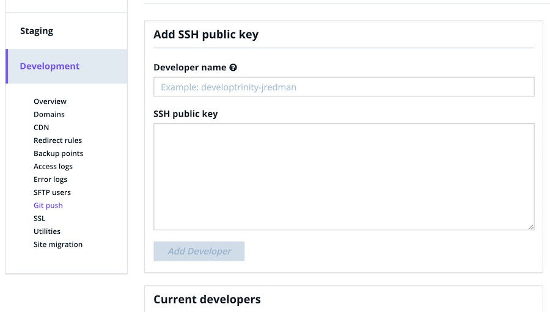

GitHub Actions have unlocked a lot of power in automating tasks we previously had to perform by other means (often manually) -- deploying WordPress sites included. Recently, I was tasked with setting up a WordPress repository to automatically deploy to a WP Engine environment whenever a commit is made to the `main` branch.

There exists a variety of actions in the marketplace for taking care of this with little configuration. For example, [this one](https://github.com/jovrtn/github-action-wpengine-git-deploy) by [Jesse Overton](https://ovrtn.com/) gets the job done well.

But in my particular scenerio, I needed to install [Composer](https://getcomposer.org/) dependencies after each deployment, and while that requirement doesn't sound terribly complex, I was new to the WP Engine ecosystem, some of the fundamentals of SSH, and the basics of GitHub actions. That didn't mix well, and it caused some lengthy frustrations. These frustrations led me to break down the entire process step-by-step, and you're gonna read about it.

## Build an Action from Scratch

We're gonna walk through what it looks like to build a GitHub action from scratch that'll do the following when a commit is made to the `main` branch:

* Check out repository files inside the action.
* Push the files to the WP Engine remote Git host (to deploy them).
* Run `composer install` inside the remote WP Engine server to install PHP dependencies.

And so it's ultra-clear what's going on under the hood, we won't be using any third-party community actions to handle it. Just some proprietary GitHub stuff, SSH, and some shell scripting.

### Generate & Set SSH Keys

Before we get our hands dirty with much code, we need to we need generate **TWO** pairs of SSH keys -- one pair for authenticating with WP Engine's Git host, and another for accessing the server itself.

Run the following command, which will save a new pair of keys to `~/.ssh/gitkey` and `~/.ssh/gitkey.pub` files. When prompted for a passphrase, just press "ENTER" straight through it. Eventually, you'll see some need terminal art, indicating the key generation is complete.

```sh
sh-keygen -t rsa -b 4096 -f ~/.ssh/gitkey
```

Now, do the same for the key we'll use to access the server.

```sh
sh-keygen -t rsa -b 4096 -f ~/.ssh/accountkey
```

In the WP Engine dashboard, we'll now need to add the newly created "Git" key to our environments. In reality, you'll probably have multiple environments. For our purposes, we'll just focus on one. In that evironment, head to the "Git Push" page, which will look something like this:



Copy the first _public_ key we created by running `pbcopy < ~/.ssh/gitkey.pub` and paste that value into WP Engine's dashboard. And after that, navigate to [your profile](https://my.wpengine.com/ssh_keys) in the dashboard, and create a new SSH key for your account. This _public_ key ("public" is important!) can be copied by running `pbcopy < ~/.ssh/accountkey.pub`.

### Stub Out a Shell Script

With that stuff in place, let's start stubbing everything out in a raw Shell script. Create it like so:

```sh
echo '#!/usr/bin/env sh' > deploy.sh
```

#### Push to WPE Git Host

With fresh file in hand, let's first set it up to push the current repository to WP Engine's remote Git host (`git.wpengine.com`) over the SSH protocol. Let's store that value at the top of our file, where we'll be referencing our SSH keys, and a couple of other WP Engine values we'll need, all of which can be found in your WP Engine dashboard.

```diff
# !/usr/bin/env sh

+ SSH_PATH="$HOME/.ssh"
+ WPE_GIT_HOST="git.wpengine.com"
+ WPE_ENVIRONMENT="production"
+ WPE_SITE_NAME="my-staging-site"
+ KNOWN_HOSTS_PATH="$SSH_PATH/known_hosts"
+ SSH_PRIVATE_KEY_PATH=$SSH_PATH/gitkey
+ SSH_PUBLIC_KEY_PATH=$SSH_PATH/gitkey.pub
```

Now, we'll need to add this Git host to our `known_hosts` file, so that the system can identify it as a valid host with which we'd like to communicate.

```diff
# !/usr/bin/env sh

SSH_PATH="$HOME/.ssh"
WPE_GIT_HOST="git.wpengine.com"
WPE_ENVIRONMENT="production"
WPE_SITE_NAME="my-staging-site"
KNOWN_HOSTS_PATH="$SSH_PATH/known_hosts"
SSH_PRIVATE_KEY_PATH=$SSH_PATH/gitkey
SSH_PUBLIC_KEY_PATH=$SSH_PATH/gitkey.pub

- echo $SSH_PATH
+ ssh-keyscan -t rsa "$WPE_GIT_HOST" >> "$KNOWN_HOSTS_PATH"
```

With that in place, let's fill those key paths with the keys themselves. GitHub Actions provides a means of storing "secrets" that we can reference in our actions. Within our script, those will just be variables we can use like any other. So, let's write the contents of those variables tot he files:

```sh
# ...stuff we've already written.

echo "$SSH_PRIVATE_KEY" > "$SSH_PRIVATE_KEY_PATH"
echo "$SSH_PUBLIC_KEY" > "$SSH_PUBLIC_KEY_PATH" //do we need this?
```

And let's also add some permissions to those files, so the action has the authority to do what it needs to do. At the end of the file, add the following:

```sh
# ...stuff we've already written.

chmod 700 \"$SSH_PATH\"
chmod 644 \"$KNOWN_HOSTS_PATH\"
chmod 600 \"$SSH_PRIVATE_KEY_PATH\"
chmod 644 \"$SSH_PUBLIC_KEY_PATH\"
```

We're ready to push to the remote WP Engine Git host! And these lines will do it:

```sh
git config core.sshCommand "ssh -i $SSH_PRIVATE_KEY_PATH -o UserKnownHostsFile=$KNOWN_HOSTS_PATH"
git remote add $WPE_ENVIRONMENT git@$WPE_GIT_HOST:$WPE_ENVIRONMENT/$WPE_SITE_NAME.git
git push $WPE_ENVIRONMENT master --force
```

The first line sets up Git with our SSH key for authentication. The next will add the WP Engine Git repo as our remote, and the final line pushes the code up. After this runs, our code will be deployed.

#### Install Composer Dependencies

